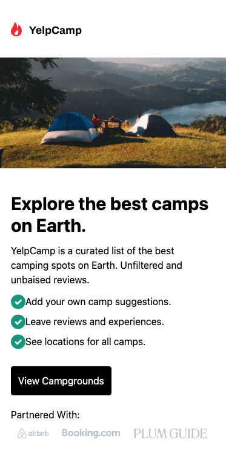
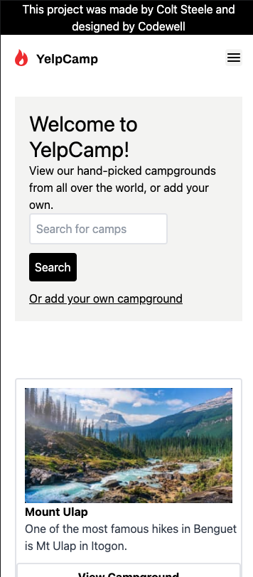
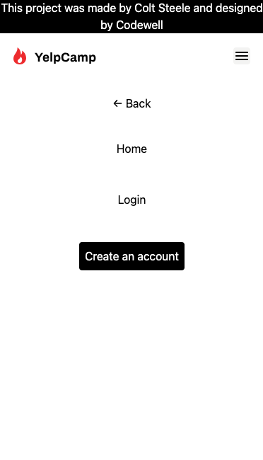
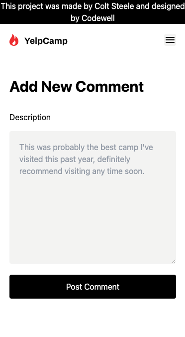

# Yelp Camp

### About this Web App

This web app is created with ReactJS and Tailwindcss. I used the design from Codewell to mainly focus on my reactjs and tailwindcss skills. All code implemented here are my own. 

### Used

React JS: useState hook, Context API, react router
Tailwindcss

 
 

 
 
 

## Live Demo: https://myatik.github.io/YelpCamp/